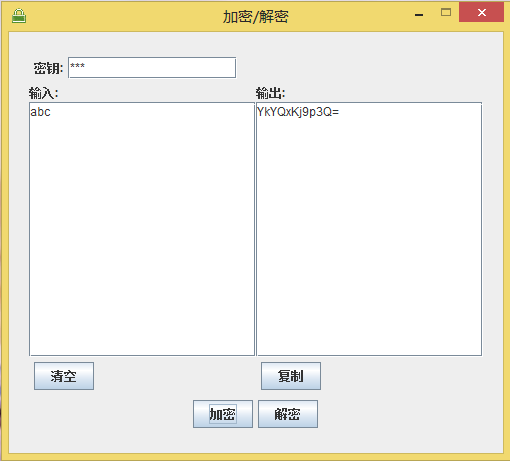

## 加密解密

各种密码，太多了，经常容易忘记，所以写了个小程序，用来加密这些密码，并保存起来
只要记住一个密钥就可以了

 输入密钥，对信息进行加密
解密时，输出正确的密钥，才会解密正确，否则解密失败

环境：JDK1.7或以上

### 命令方式

使用方法：
加密：java -jar Encryption.jar -e express key

解密：java -jar Encryption.jar -d ciphertext key

如使用123密钥加密123456及解密

```
$java -jar encryption_cmd.jar -e 123456 123
加密后为：ItKgGw9Kp8w=
$java -jar encryption_cmd.jar -e ItKgGw9Kp8w= 123
密后为：123456
```


### 界面方式


#### 输入密钥和要加密的信息
点击加密


#### 输入密钥和要解密的密文
点击解密


